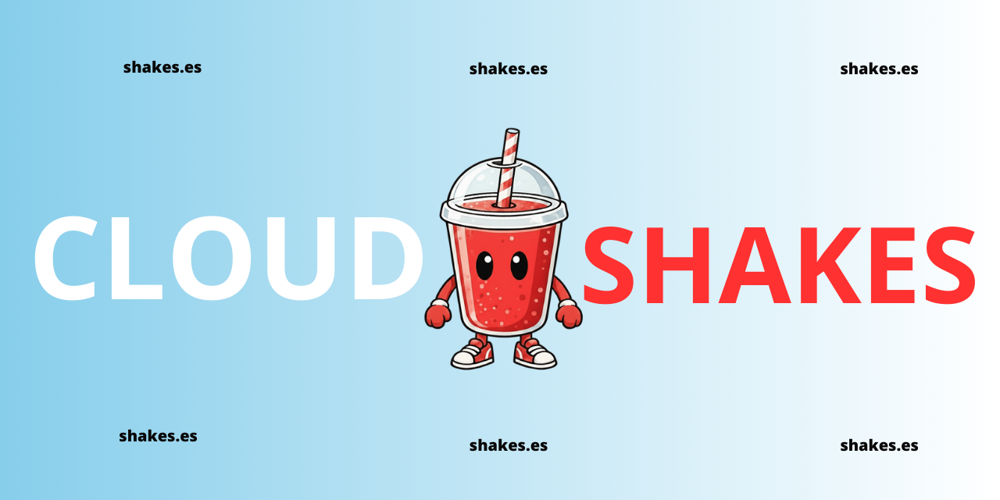

# ☁️ Cloud Shakes – Open Source Cloud Management Platform

Cloud Shakes is a modern, scalable solution for file storage, management, and sharing, designed to offer a seamless, secure, and highly customizable experience.





🌐 **Website:** [shakes.es](https://shakes.es)

📚 **Documentation:** [docs.shakes.es](https://docs.shakes.es)

📹 **Video:** [youtube.es](https://youtu.be/q5rOE5Qmwqs?si=JSmPzq3ONtJ1DZ9t)

## Features

- **Cloud Storage** with an intuitive interface
- **File & Folder Management** with drag & drop support
- **Integrated File Preview**
- **Secure Shared Links** system
- **Responsive Interface** for all devices
- **Progressive Uploads** with visual indicators
- **Advanced Search** functionality
- **Document & Note Management**
- **Integrated Calendar**
- **Usage Statistics**
- **Enhanced Security** with validation and auditing

## 🛠️ Tech Stack

### Frontend
- **Next.js 15** with App Router
- **TypeScript** for type safety
- **Tailwind CSS** for modern styling
- **Framer Motion** for fluid animations
- **Lucide React** for icons
- **Axios** for HTTP requests

### Backend
- **Node.js** with Express 4
- **TypeScript**
- **Prisma** as the ORM
- **PostgreSQL** as the database
- **JWT** for authentication
- **Multer** for file handling
- **Helmet** for security headers
- **Rate Limiting** for protection

## 📦 Installation

### Prerequisites
- Node.js 18+
- PostgreSQL 13+
- npm or yarn

### Backend Setup

1. Clone the repository:
```bash
git clone https://github.com/errriikkk/Cloud-Shakes.git
cd Cloud-Shakes
```

2. Configure environment variables:
```bash
cd backend
cp .env.example .env
# Edit .env with your credentials
```

3. Install dependencies and run migrations:
```bash
npm install
npm run db:generate
npm run db:migrate
npm run dev
```

### Frontend Setup

1. In a new terminal:
```bash
cd frontend
cp .env.example .env.local
# Edit .env.local with the backend URL
```

2. Install dependencies and start the app:
```bash
npm install
npm run dev
```

## 📂 Project Structure

```
cloud-shakes/
├── frontend/          # Next.js Application
├── backend/           # Express REST API
└── assets/           # Images and resources
```

## ⚙️ Environment Variables

### Backend (.env)
- `DATABASE_URL`: PostgreSQL connection string.
- `JWT_SECRET`: Secret key for JWT signing.
- `UPLOAD_DIR`: Directory for file storage.
- `ALLOWED_ORIGINS`: CORS configuration.

### Frontend (.env.local)
- `NEXT_PUBLIC_API_URL`: Backend API endpoint.

## 🔒 Security

Implemented security features:
- **Input Validation** with Zod
- **Rate Limiting** on critical endpoints
- **Strict CORS** configuration
- **CSP with Helmet**
- **Filename Sanitization**
- **File Type Validation**
- **Audit Logs** for administrative actions
- **CSRF Protection**

## 🚀 Deployment

### Docker
```bash
docker-compose up -d
```

### Production
Build and start the services manually:
```bash
# Backend
cd backend && npm run build && npm start

# Frontend
cd frontend && npm run build && npm start
```

## 🤝 Contributing

Contributions are welcome!
1. Fork the project
2. Create your feature branch (`git checkout -b feature/amazing-feature`)
3. Commit your changes (`git commit -m 'Add amazing feature'`)
4. Push to the branch (`git push origin feature/amazing-feature`)
5. Open a Pull Request

## 📄 License

This project is licensed under the MIT License with commercial restrictions. See the [LICENSE](LICENSE) file for details.

### Important Restrictions
- ✅ Personal and internal organizational use.
- ❌ Reselling or redistributing as a standalone product.
- ✅ Modifying for internal use.
- ❌ Removing copyright notices.

## 💖 Acknowledgments

- Next.js team
- Tailwind CSS team
- Prisma team
- Lucide icons

---

**Made with ❤️ by the open-source community**
